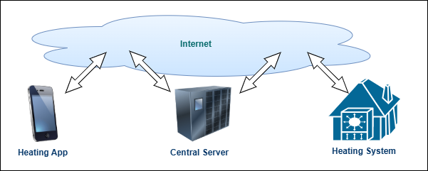
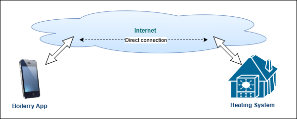
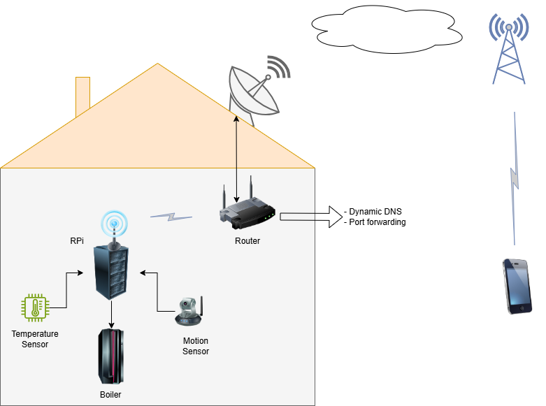

# Raspberry Pi based Predictive Heting Control

`Boilerry` is a remote *Point-to-Point* household temperature control system that allows the user to control their central heating via an App that connects directly to the *boiler*, not allowing anyone to harvests their behaviour.

Pretty much all household heating systems Apps like *Hive*, *Google Nest*, *Drayton*, etc. do not connect directly to the household heating system. The connection is established via a central server.

This allows those companies to monitor the users behaviour, silently harvesting data like:
- The property address.
- The location of the user in any moment in time (their App sends this information in the background).
- User's bahaviour (preferred temperature in different times of the day, etc.)
- The property's energy consumption.
- And many more..

The `Boilerry` heating control system on the other hand establishes direct link between the mobile App and the household heating system. This provides the user with maximum privacy.

The Predictive Heting Control server component monitors the household and based on pattern of arrival and leaving the property, fine tunes the heating system for better efficiency and comfort.
This is an open source project, allowing the user to further customise their system control system.

Note: This is project is in progress, hence some features may not work or be fully completed.

### Hardware
RaspberryPi Zero with dual-relay module and switching power supply.

### Software
Python based server side software providing a Web socket connection from the Android mobile phone app through which the end user can control and monitor the household heating system.
